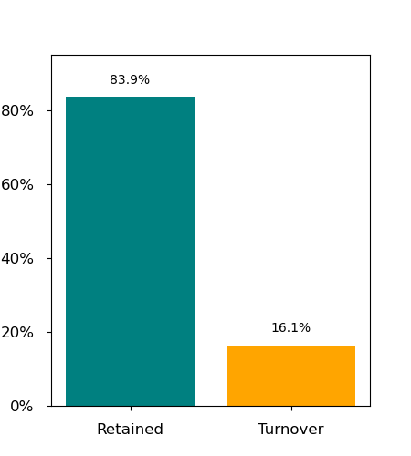

# Analysis of Factors Affecting Workplace Turnover

## Purpose of Project

Employee turnover is a major concern for many employers.  The costs associated with unwanted attrition in terms of replacement, training, and lost opportunities and institutional knowledge, among other consequences, can be staggering.  Business and HR leaders need in-depth analyses of the causes of turnover in order to create effective strategies to combat it.  

## Project Description

This analysis is based on employee records from a Kaggle dataset (*IBM HR Analytics Employee Attrition & Performance*) for 1470 individuals in three departments of one fictional company.  Eighty-four percent of the employees are still actively employed; 16% have left the company. 

The records contain information about 35 features for each employee, which I have whittled down to 23. I conducted a logistic regression analysis to train the algorithm to predict employment status (active or terminated) based on those 23 factors and then calculated feature importance scores to identify the employment factors that have the most impact on the company's ability to retain its employees.

The data is stored in a postgreSQL database which, if this were a real company, would feed the data to the visualizations in real time.  Visualizations dependent on the logistic regression are done with plotly; the others were done in tableau and embedded in the html code.  (Because the free version of Tableau public cannot connect to a database, these visualizations were taken as images.  They would have to be updated within Tableau if the data changed.)

An interactive tool allows the user to select any of 13 key employment factors and view its relationship to turnover in both table and bar chart format.  These were built in javascript d3 drawing the data through a Flask app which in turn is fed from the postgreSQL database.

A second tool calculates estimated cost savings or additional expense depending on how much turnover increases or decreases, and another predicts the odds that an active employee will leave the company.

## Notes on the Data

Most of the data is categorical with each category either represented by numbers in the original dataset or converted to numeric values in order to perform the analyses.  The following guide translates the numeric codes for anyone interested in studying the data in raw form.  

Attrition
0 'No' (i.e, actively employed)
1 'Yes' (i.e., has left the organization)

Business Travel:  
0 'No travel'
1 'Rarely'
2 'Frequently'

Department
0 'Human Resources
1 'Sales'
2 'R & D'

Education
1 'Below College'
2 'College'
3 'Bachelor'
4 'Master'
5 'Doctor'

Environment Satisfaction
1 'Low'
2 'Medium'
3 'High'
4 'Very High'

Gender
0 'Female'
1 'Male'

Job Involvement
1 'Low'
2 'Medium'
3 'High'
4 'Very High'

Job Satisfaction
1 'Low'
2 'Medium'
3 'High'
4 'Very High'

Performance Rating
1 'Low'
2 'Good'
3 'Excellent'
4 'Outstanding'

Relationship Satisfaction
1 'Low'
2 'Medium'
3 'High'
4 'Very High'

Work/Life Balance
1 'Bad'
2 'Good'
3 'Better'
4 'Best'